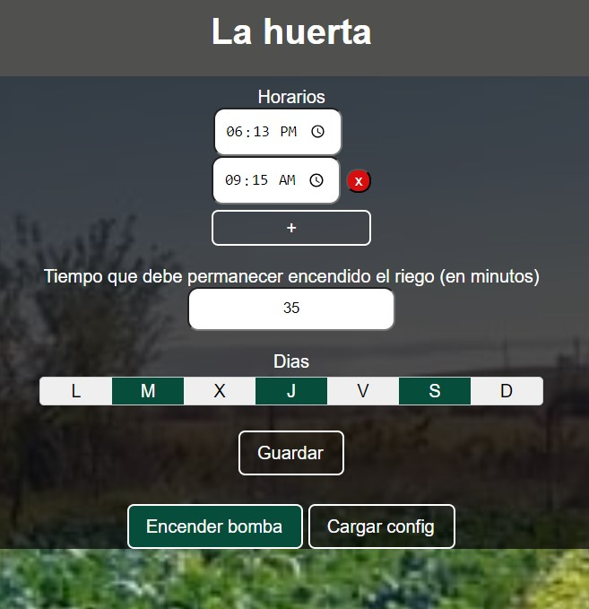

# HuertaManu

HuertaManu es un proyecto para ESP8266 para el control automático de una huerta. El proyecto nunca se llevó a cabo por diferentes circunstancias, pero de todas maneras es totalmente funcional.

## Componentes

1. NodeMCU
2. Relay 5v
3. Reloj RTC

## Funcionamiento

1. El relé debe conectarse al pin D6 y a una bomba de agua.
2. Una vez encendido el microcontrolador, éste proporciona una red WIFI (HuertaManu), la cual despliega una página web
3. El usuario configura el horario de encendido y apagado de la bomba. También puede encenderla en el momento, cliqueando en "Encender ahora"

## Screenshots

